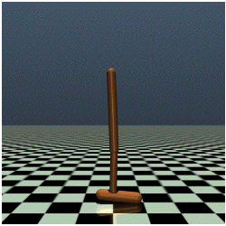
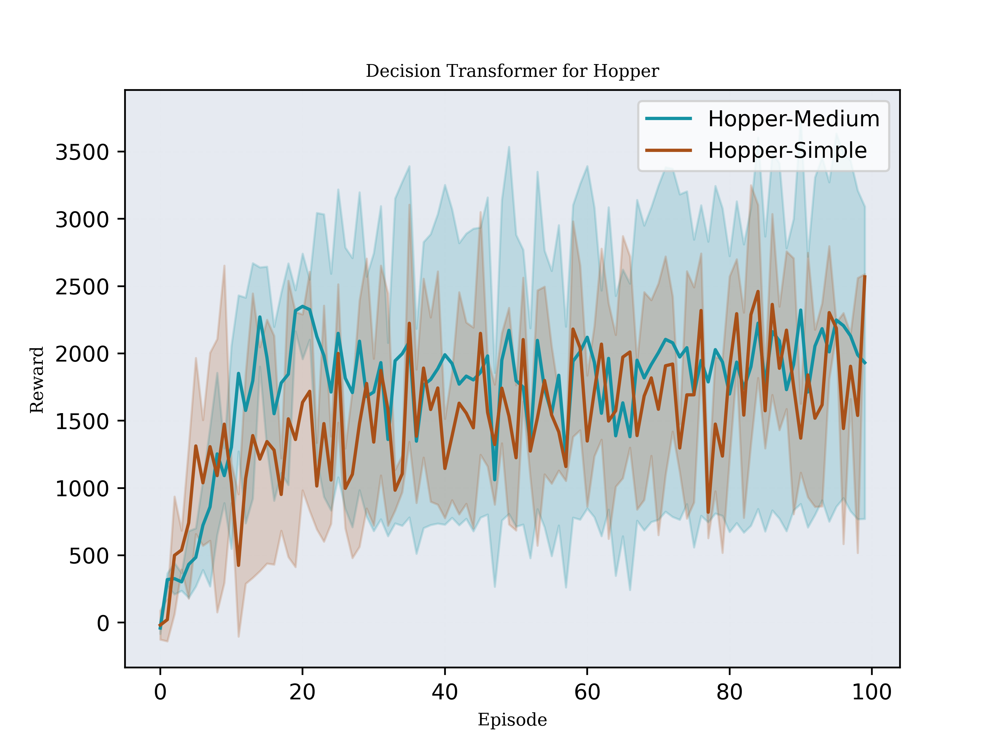
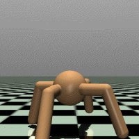
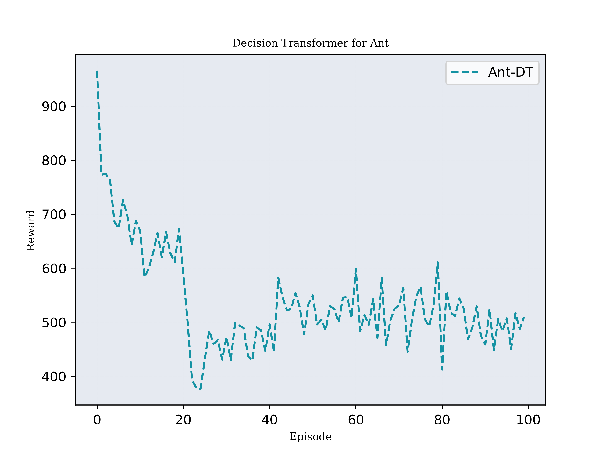
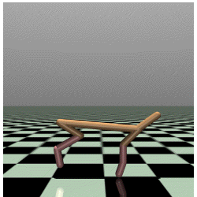
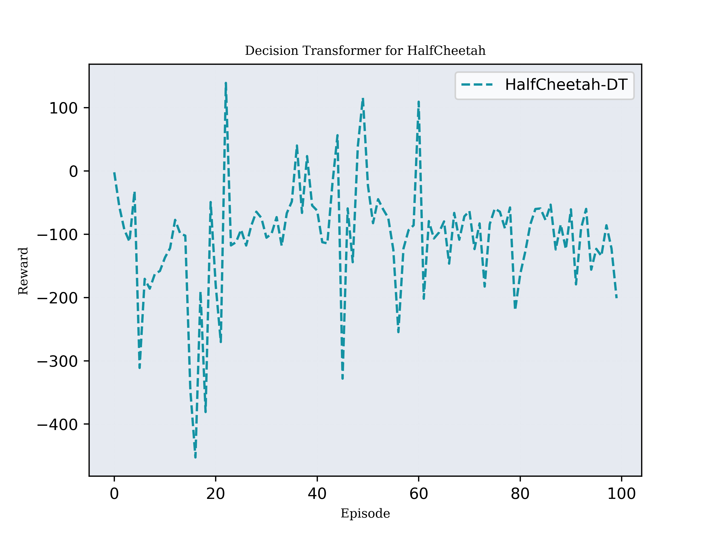

Implementation for paper: Decision Transformer: Reinforcement Learning via Sequence Modeling
[Paper Link](https://arxiv.org/pdf/2106.01345)

### Tranformer Arch
1. Single Head with Embedding Size 128
2. FeedForward Head with 3 Layers.

### Experiments

1. Hopper Medium from D4RL Averaged over three random seeds.

   

2. Ant Medium from D4RL Averaged over three random seeds.
   

3. Half-Cheetah Medium from D4RL Averaged over three random seeds.
   
